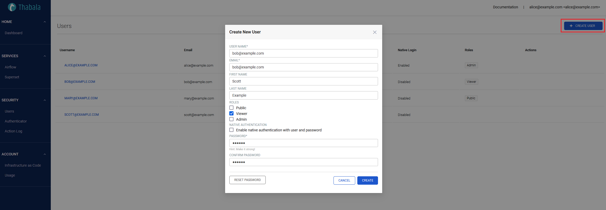

Managing users for all services is centralised in Thabala.
You need to create users in Thabala and associate them to certain services.
This allows you to use the same user across the [Thabala Admin Console](/admin-console/introduction),
the Thabala API, the [Thabala CLI](/thabala-cli) and all the managed service.

You will use the same users across the entire Thabala ecosystem but the permissions are separated for the
Thabala Admin Console and for the services. You can read more about it in the
[Roles and Permsissions](/admin-console/security/roles-and-permissions) page.

## Creating Users in the Thabala Admin Console

In the Thabala Admin Console go to the **Security -> Users** menu item, click the **Create User** button
and fill the form as below:

* **User Name**: Anything meaningful. It's not required but recommended to be a valid email to be straightforward configuring [OAuth2 over HTTPS](/admin-console/security/oauth2) later on.
* **Email**: Email of the user
* **First Name**: First name of the user
* **Last Name**: Last name of the user
* **Roles**: One or multiple roles to be granted for the user.
Roles defined here are valid only to the Thabala Admin Console and don't include permissions to service instances.
Once you have running service instances you'll need to grant service specific roles to the users separately.
It's common practice that the same user has no permission to the Thabala Admin Console but has permissions for
specific service instances or vice versa. For further details check the [Roles and Permsissions](/admin-console/security/roles-and-permissions) page.
* **Enable native authentication with user and password**: Enable this option if you want the user to be able to use
the native user/password based [Internal Thabala Authenticator](/admin-console/security/internal-thabala-authenticator) even if 
the Thabala account is configured to use [OAuth2 over HTTPS](/admin-console/security/oauth2). Having one user with this option is a
good practice making sure that a dedicated, admin user can always login to the system.
* **Password**: Use a strong password. It will be used only for the [Internal Thabala Authenticator](/admin-console/security/internal-thabala-authenticator).
If the Thabala account is configured to use [OAuth2 over HTTPS](/admin-console/security/oauth2)
then this password will be ignored.



:::info

To get more familiar with the different authentication types please check the
[Authentication types](/admin-console/security/authentication-types) page.

:::

## Create Service Instance Admins by the Thabala CLI

Optionally you can define the same thing as YAML file using the `Users` kind and can apply it by the [Thabala CLI](/thabala-cli).

```yaml
kind: Users
users:
- username: alice@example.com
  first_name: Alice
  last_name: Example
  email: alice@example.com
  roles:
  - name: Admin
  db_auth_enabled: true
- username: bob@example.com
  first_name: Bob
  last_name: Example
  email: bob@example.com
  roles:
  - name: Viewer
  db_auth_enabled: false
- username: mary@example.com
  first_name: Mary
  last_name: Example
  email: mary@example.com
  roles:
  - name: Public
  db_auth_enabled: false
- username: scott@example.com
  first_name: Scott
  last_name: Example
  email: scott@example.com
  roles: []
  db_auth_enabled: false
```
