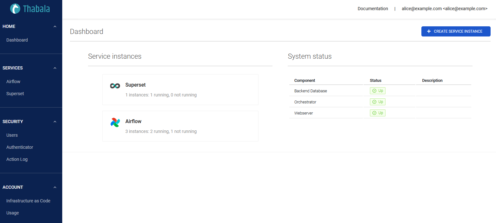

Thabala providesa a web interface to manage your Thabala account securely in a web browser.

Using the web interface you can start/pause/delete service instances, can see logs, monitor metrics or scale up/down.
Using the web interface you also can create users and can allocate them to certain service instances with
the required permissions.

:::tip

To manage your account programmatically or as Infrastructure as Code
you can use the the [Thabala Command Line Interface](/cli).

Everything that can be done in Web Admin Console in a web browser
is can be done programmatically by the Thabala CLI.

:::
