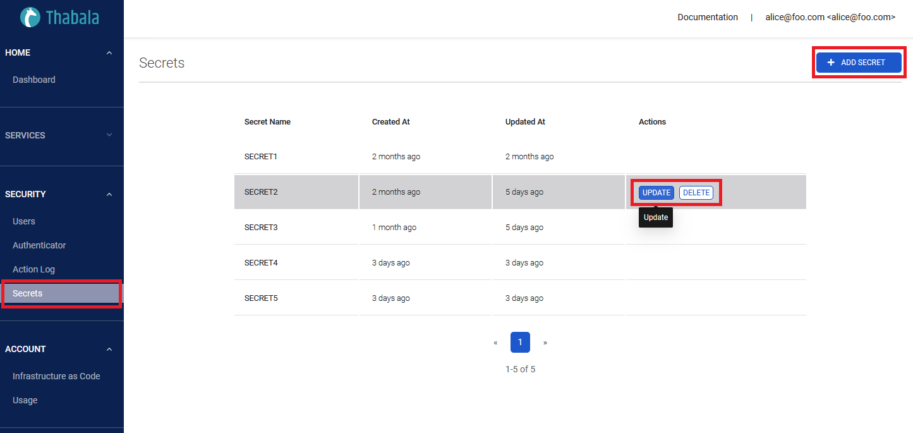

Encrypted secrets allow you to store sensitive information in your Thabala account.
Secrets are encrypted environment variables. The secrets that you create are available to use in
Thabala [infrastructure YAML files](/admin-console/iac) and remain encrypted until you use them.

## Naming your secrets

The following rules apply to secret names:

* Secret names can only contain alphanumeric characters (`[a-z]`, `[A-Z]`, `[0-9]`) or underscores (`_`). Spaces are not allowed
* Secret names must not start with a number
* Secret names are not case-sensitive
* Secret names must be unique

## Creating encrypted secrets

To create secrets, you must have the `Admin` role.

1. In the left menu of the [Thabala Admin Console](/admin-console/overview), go to the `Secrets` menu item.

2. Click **Add Secret** button
3. Type a name for your secret in the Name input box.
4. Enter the value for your secret.
5. Click **Add secret**.

## Using encrypted secrets in an infrastructure YAML file

To provide an action with a secret as an input or environment variable, you can use the secrets context
to access secrets you've created in your account.

```yaml
kind: Users
users:
  - username: alice@foo.com
    first_name: Alice
    last_name: Foo
    email: alice@foo.com
    password: ${{ secrets.SUPER_SECRET }}
```

If a secret has not been set, [Thabala CLI](/cli) [`apply`](/cli/commands/infra-apply) command will generate an error.

## Updating encrypted secrets

To update the value of an existing secret:

1. Click the **Update** button next the name of your secret you want to update
2. Enter the value for your secret
3. Clikc **Update**.

## Deleting encrypted secrets

To delete an existiing secret:

1. Click the **Delete** button next the name of your secret you want to delete
2. Confirm you want to delete the secret
3. Click **Delete**.

:::warning

References to not existing or deleted secrets in infrastructure YAML files are
generating error at apply time.

**Example:**

`thabala.yaml` with and [Authenticator infrastructure kind](/admin-console/iac#the-authenticator-infrastructure-kind),
using references to not existing and deleted secrets. Notice the `${{ secrets.NOT_EXISTING_SECRET }}` and
`${{ secrets.DELETED_SECRET }}` variables in the YAML:

```yaml
kind: Authenticator
authenticator:
  authenticator: github
  oauth2:
    remote_app:
      api_base_url: https://www.googleapis.com/oauth2/v2/
      authorize_url: https://accounts.google.com/o/oauth2/auth
      access_token_url: https://accounts.google.com/o/oauth2/token
      server_metadata_url: https://accounts.google.com/.well-known/openid-configuration
      client_id: ${{ secrets.NOT_EXISTING_SECRET }}
      client_secret: ${{ secrets.DELETED_SECRET }}
    authenticated_users:
      auth_user_registration_role: ''
      auth_user_registration: false
    browser_mode_redirect_port: 53442
```

Error when applying the file:

```shell
$ thabala apply -f thabala.yaml
[2022-10-18 12:00:00,000]  INFO - Applying users...
400 Client Error: BAD REQUEST - Undefined template variable. 'dict object' has no attribute 'NOT_EXISTING_SECRET
```

:::