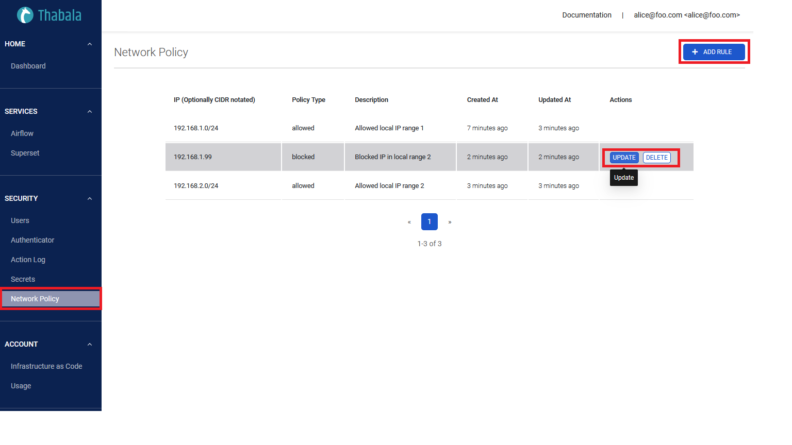
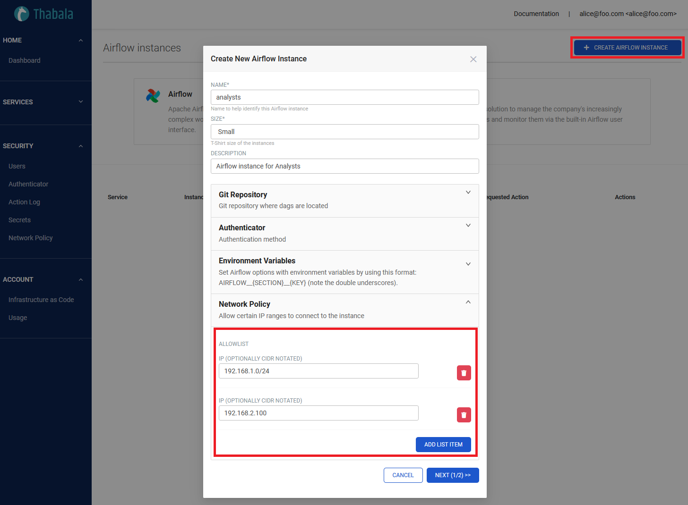

Network policies provide options for managing network configurations to the Thabala account and services.
Network policies allow restricting access to your account based on user IP address.
Effectively, a network policy enables you to create an IP allowed list, as well as an IP blocked list, if desired.

By default, Thabala allows users to connect to the [Admin Console](/admin-console/overview) and all running services
from any computer or device IP address. A Thabala user with the [Admin Role](/admin-console/security/roles-and-permissions#built-in-permissions-and-roles)
can create a network policy to allow or deny access to the [Admin Console](/admin-console/overview) to a single
IP address or a list of addresses. Also, Thabala account administrators and [Service Instance Admins](/admin-console/security/roles-and-permissions#service-instance-admins)
can define additional and separated network policies for each service instances independently.

Network policies currently support only Internet Protocol version 4 (i.e. IPv4) addresses.

## CIDR Notation

Thabala supports specifying ranges of IP addresses using [Classless Inter-Domain Routing (i.e. CIDR) notation](https://www.rfc-editor.org/rfc/rfc4632).
In CIDR notation, the optional subnet is expressed as a decimal number that represents the prefix length:

```
ip_address[/prefix_length]
```

For example, `192.168.1.0/24` represents all IP addresses in the range of `192.168.1.0` to `192.168.1.255`.


## Creating Network Policy for the Admin Console

Network Policy for the Admin Console restricts from which computer or device IP address you can connect to manage
the Thabala account. This restriction is valid for accessing the [Admin Console](/admin-console/overview) by both the
Web User Interface and by the [Thabala CLI](/cli) at the same time.


1. In the left menu of the [Thabala Admin Console](/admin-console/overview), go to the `Network Policy` menu item.

2. Click **Add Rule** button
3. Add the IP address optionally with CIDR notation
4. Select policy type **Allowed** or **Blocked**
5. Optionally add a description
5. Click **Add**.

### Examples of Allowed / Blocked Address Lists

The following are representative examples to define allowed and blocked IP address ranges.

Allow all IP addresses in the range of `192.168.1.0` to `192.168.1.255`, except `192.168.1.99`,
which is explicitly blocked. In addition, all other IP addresses are blocked:

```
    - Allowed IP Addresses: 192.168.1.0/24
    - Blocked IP Addresses: 192.168.1.99
```

Allow only the `192.168.1.0` and `192.168.1.100` IP addresses to access your account:

```
    - Allowed IP Addresses: 192.168.1.0,192.168.1.100
    - Blocked IP Addresses: N/A
```

Assuming the current IP address is `192.168.1.0`, block all other IP addresses.

```
    - Allowed IP addresses: 192.168.1.0
    - Blocked IP addresses: 192.168.1.0/0
```

### Creating Network Policy using the Thabala CLI

Optionally you can define the same thing as YAML file using the
[`NetworkPolicy`](/admin-console/iac#the-networkpolicy-infrastructure-kind) infrastructure kind and can apply it by the [Thabala CLI](/cli).

```yaml
### Network Policy that controls from which IP addresses the Thabala Admin Console can be accessed.
### IMPORTANT: This policy doesn't apply on service instances.
kind: NetworkPolicy
rules:
- ip: 192.168.1.0/24
  policy_type: allowed
  description: Allowed local IP range 1
- ip: 192.168.1.99
  policy_type: blocked
  description: Blocked IP in local range 2
- ip: 192.168.2.0/24
  policy_type: allowed
  description: Allowed local IP range 2
```

## Creating Network Policy for Service Instances

Network Policy for specific service instances restricts from which computer or device IP address you can connect
to **certain service instances**. All [Supported services in Thabala](/services) has the option to define
network policy for each service instance.




:::info

Behaviour of Service Instance Network Policies:
* If the Allowlist **is empty** then connection to the service instance is **allowed from all IP addresses**.
* For service instances you can define **only Allowed network policy rules** and no blocked rules. Connections
from IPs that not in the allowlist are blocked automatically.

:::

### Creating Service Instance Network Policy using the Thabala CLI

Optionally you can define the same thing as [Infrastructure as Code](/admin-console/iac) in a YAML file under
the `networkPolicy` property in the `ServiceInstance` infrastructure kind and can apply it by the [Thabala CLI](/cli).

```yaml
kind: ServiceInstance
instance:
  service_id: airflow
  name: analysts
  size: small
  extra:
    description: Airflow instance for Analysts
    gitSync:
      repo: https://github.com/thabala-Cloud/airflow-sandbox-public-dags
      sshKey: null
      branch: null
      rev: null
      subPath: /dags
    auth:
      authenticator: google
    oauth2:
        api_base_url: https://www.googleapis.com/oauth2/v2/
        authorize_url: https://accounts.google.com/o/oauth2/auth
        access_token_url: https://accounts.google.com/o/oauth2/token
        server_metadata_url: https://accounts.google.com/.well-known/openid-configuration
        client_id: ${{ secrets.GOOGLE_OAUTH_CLIENT_ID }}
        client_secret: ${{ secrets.GOOGLE_OAUTH_CLIENT_SECRET }}
      authenticated_users:
        allowlist: []
    env: {}
    ### Network Policy that applies only this service instance
    networkPolicy:
      allowlist:
      - ip: 192.168.1.0/24
      - ip: 192.168.2.100
users:
- username: alice@foo.com
  admin: true
  service_roles:
  - name: Admin
```