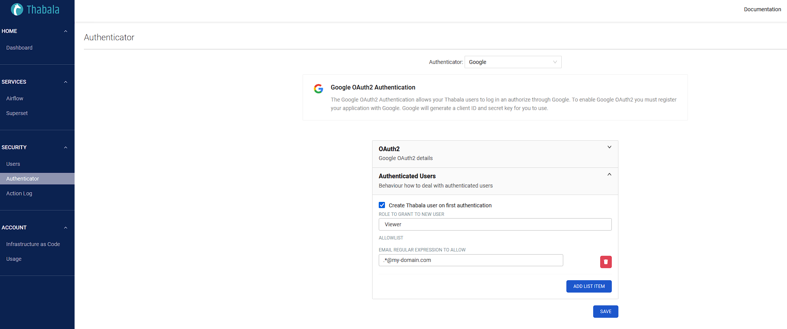

Authenticating via [OAuth2 over HTTPS](./oauth2) using the supported
[OAuth2 Identity Provider](./oauth2#oauth-20-identity-providers) comes with a few extra options that control
how to deal with the authenticated users by the external Identity Provider.
You can find them at **Authenticator -> Authenticated Users**:

* **Create Thabala user automatically**: If this option is enabled then Thabala users are automatically
created at a successful authentication. In this case Thabala users are self registered and you can
provide `Public` or `Viewer` [roles](./roles-and-permissions) automatically to the authenticated users.
If this option is disabled (*by default*), then you need to create the Thabala users in advance by an
existing user with the `Admin` role. This can be done by the Thabala Admin Console (*web UI*) or by the
[Thabala CLI](/cli). Self-registration is more convenient and more transparent but creating users
separately is more secure.
* **Allowlist**: List of authenticated email patterns who are allowed to login. **Empty list means no pattern
so every authenticated user by the IdP is allowed to login** (*default*).

