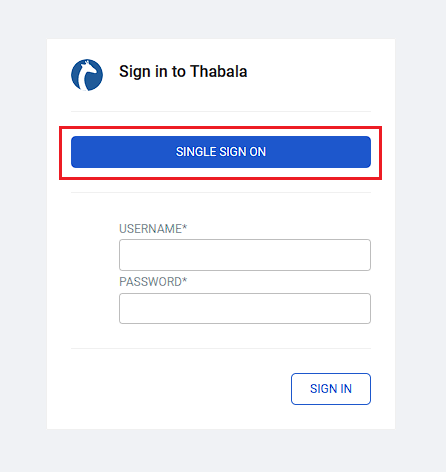

# GitHub as OAuth2 identity provider

This section provides specific information for setting up OAuth 2.0 for Thabala in GitHub. There are two tasks to complete:

* Create an Authorized OAuth App in GitHub
* Configure the Thabala Admin Console

## Create an Authorized OAuth App in GitHub

In **GitHub Developer Settings**, create an OAuth App following the [Official GitHub documentation](https://docs.github.com/en/developers/apps/building-oauth-apps/creating-an-oauth-app)
and fill the form as per the below:

* **Application Name**: Anything meaningful, a good name could be `Thabala Admin Console`
* **Homepage URL**: `https://<thabala-account-domain-name>`. This value is unique for your Thabala account.
* **Auth Description**: Anything meaningful
* **Authorization Callback URL**: `https://<thabala-account-domain-name>/oauth-authorized`. This value is unique for your Thabala account. You can get the full redirect URL in the Thabala Admin Console under the **Authenticator** menu item. Check
the screenshot in the [Configure the Thabala Admin Console](#configure-the-thabala-admin-console) section.

Once the app is created in Github you will receive a **Client ID** and you will need to generate a **Client Secret**. Put them into a safe place, you will need them in the following steps.

## Configure the Thabala Admin Console

c

* **Api Base URL**: `https://api.github.com/`
* **Authorize URL**: `https://github.com/login/oauth/authorize`
* **Access Token URL**: `https://github.com/login/oauth/access_token`
* **Server Metadata URL**: Leave it empty
* **Client ID**: Client ID generated by GitHub in the previous point
* **Client Secret**: Client generated by GitHub in the previous point


:::caution

Make sure to use the correct Authorization Callback URL in the GitHub OAuth App settings to match the
one that is generated by the Thabala Admin Console. Highlighted in the screenshot above.

:::

## Configure it in the Thabala Command Line Interface

Optionally you can configure it as YAML using the `Authenticator` kind and can apply it by the [Thabala CLI](/thabala-cli).

```yaml
kind: Authenticator
authenticator:
  authenticator: github
  oauth2:
    remote_app:
      api_base_url: https://api.github.com/
      authorize_url: https://github.com/login/oauth/authorize
      access_token_url: https://github.com/login/oauth/access_token
      server_metadata_url: null
      client_id: enc/<encrypted-string>
      client_secret: enc/<encrypted-string>
```

:::info

The `client_id` and `client_secret` values are automatically encrypted and identified by the `enc/` prefix.
Based on your security requirements if you don't like the auto encrypted values in the YAML files then you
can use secure variables which are replaced with the actual values at runtime. Using this method
you do not need to keep encrypted secrets in YAML files and in your version control system.

:::

## Validate GitHub OAuth2 in the Thabala Web Login Page

If everything set up correctly then you should see the `Single Sign On` button on the Thabala login screen.
Clicking on it you should be redirected to the GitHub authentication screen.

<div style={{textAlign: 'center'}}>



</div>

:::info

Username and Password fields are still visible but this option is working only for special users who are
explicitly allowed to be authenticated without OAuth2.

:::

## Validate GitHub OAuth2 by the Thabala CLI

Users of the Thabala CLI can be authenticated by GitHub OAuth2 by setting the `authenticator` to `EXTERNALBROWSER` in the
`~/.config/thabala/cli.cfg` config file. When using the external browser authenticator the `username` and `password`
need to be empty.

`~/.config/thabala/cli.cfg`:
```yaml
[default]
account_url = https://th12345.us-east-1.thabala.com
authenticator = EXTERNALBROWSER
username =
password =
```

If the Thabala CLI is configured to use the `EXTERNALBROWSER` authenticator then it pops up the GitHub
authentication page in your default browser when running a CLI command.
For example running the `thabala get service-instances` command you should see the GitHub authentication page
in your default browser and the command should act as below:

```commandline
$ thabala get service-instances
Initiating login request with your identity provider. A browser window should have opened for you to complete the login. If you can't see it, check existing browser windows, or your OS settings. Press CTRL+C to abort and try again...
{
    "result": [],
    "total_entries": 0
}
```
