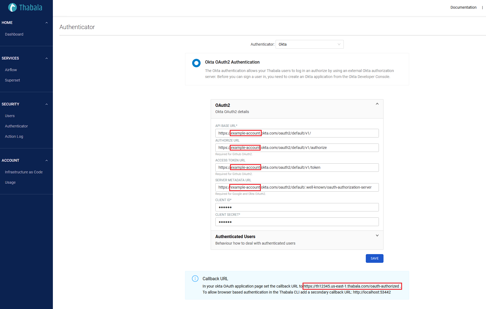

# Okta as OAuth2 identity provider

This section provides specific information for setting up OAuth 2.0 for Thabala in Okta. There are two tasks to complete:

* Create an Okta app
* Configure the Thabala Admin Console

## Create an Okta app

In the **Okta Admin Console**, create an Okta app integration following the [Official Okta documentation](https://developer.okta.com/docs/guides/sign-into-web-app-redirect/asp-net-core-3/main/#create-an-okta-integration-for-your-app)
and fill the form as per below:

* **Sign-in method**: *OIDC - OpenID Connect*
* **Application type**: *Web Application*
* **App integration name**: Anything meaningful, a good name could be `Thabala Admin Console`
* **Sign-in redirect URIs**: `https://<thabala-account-domain-name>/oauth-authorized`. This value is unique for your Thabala account. You can get the full redirect URL in the Thabala Admin Console under the **Authenticator** menu item. Check
the screenshot in the [Configure the Thabala Admin Console](#configure-the-thabala-admin-console) section.

:::info

To allow browser based authentication for the Thabala CLI add a secondary **Sign-in redirect URI**: `http://localhost:53442`.

:::

* **Controlled Access**: Select *Everyone in your organization* for now. For more information, see the [Assign app integrations](https://help.okta.com/oie/en-us/Content/Topics/Provisioning/lcm/lcm-user-app-assign.htm?cshid=ext-lcm-user-app-assign) topic in the Okta product documentation.

Once the app is created in Github you will receive a **Client ID** and you will need to generate a **Client Secret**. Put them into a safe place, you will need them in the following steps.

## Configure the Thabala Admin Console

In the Thabala UI open the **Authenticator** menu item and fill, select **Okta** as the authenticator and fill
the form as below:

* **Api Base URL**: `https://example-account.okta.com/oauth2/default/v1/`
* **Authorize URL**: `https://example-account.okta.com/oauth2/default/v1/authorize`
* **Access Token URL**: `https://example-account.okta.com/oauth2/default/v1/token`
* **Server Metadata URL**: `https://example-account.okta.com/oauth2/default/.well-known/oauth-authorization-server`
* **Client ID**: Client ID displayed in Okta Admin Console in the previous point
* **Client Secret**: Client Secret displayed in Okta Admin Console in the previous point



:::caution

1. Replace `example-account` in the URLs above implicitly to your Okta account URL.
2. Make sure to use the correct callback URLs in the Okta Admin Console generated to match with the one that 
is generated by the Thabala Admin Console. Highlighted in the screenshot above.

:::

## Configure by the Thabala Command Line Interface

Optionally you can configure it as YAML using the `Authenticator` kind and can apply it by the [Thabala CLI](/thabala-cli).

```yaml
kind: Authenticator
authenticator:
  authenticator: okta
  oauth2:
    remote_app:
      api_base_url: https://example-account.okta.com/oauth2/default/v1/
      authorize_url: https://example-account.okta.com/oauth2/default/v1/authorize
      access_token_url: https://example-account.okta.com/oauth2/default/v1/token
      server_metadata_url: https://example-account.okta.com/oauth2/default/.well-known/oauth-authorization-server
      client_id: enc/<encrypted-string>
      client_secret: enc/<encrypted-string>
```

:::info

The `client_id` and `client_secret` values are automatically encrypted and identified by the `enc/` prefix.
Based on your security requirements if you don't like the auto encrypted values in the YAML files then you
can use secure variables which are replaced to the actual values at runtime. Using this method
you do not need to keep encrypted secrets in YAML files and in your version control system.

:::

## Validate Okta OAuth2 in the Thabala Web Login Page

If everything set up correctly then you should see the `Single Sign On` button on the Thabala login screen.
Clicking on it you should be redirected to the Okta authentication screen.

<div style={{textAlign: 'center'}}>


</div>

:::info

Username and Password fields are still visible but this option is working only for special users who are
explicitly allowed to be authenticated without OAuth2.

:::

## Validate Okta OAuth2 by the Thabala CLI

Users of the Thabala CLI can be authenticated by Okta OAuth2 by setting the `authenticator` to `EXTERNALBROWSER` in the
`~/.config/thabala/cli.cfg` config file. When using the external browser authenticator the `username` and `password`
need to be empty.

`~/.config/thabala/cli.cfg`:
```yaml
[default]
account_url = https://th12345.us-east-1.thabala.com
authenticator = EXTERNALBROWSER
username =
password =
```

If the Thabala CLI is configured to use the `EXTERNALBROWSER` authenticator then it pops up the Okta
authentication page in your default browser when running a CLI command.
For example running the `thabala get service-instances` command you should see the Okta authentication page
in your default browser and the command should act as below:

```commandline
$ thabala get service-instances
Initiating login request with your identity provider. A browser window should have opened for you to complete the login. If you can't see it, check existing browser windows, or your OS settings. Press CTRL+C to abort and try again...
{
    "result": [],
    "total_entries": 0
}
```
