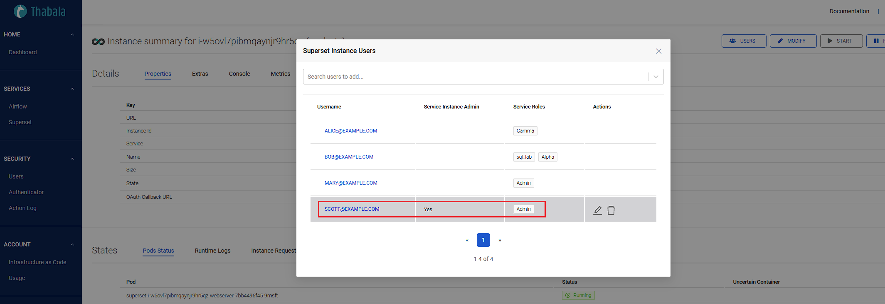

# Roles and Permissions

Thabala offers role-based access control for users. For an easy overview, permissions are groupped into pre-defined
roles in Thabala:

* **Public**: No permissions
* **Viewer**: Can view Thabala and service instance resources but can not add new or modify existing resources.
* **Admin**: Can view, add and modify existing Thabala and **all service instance resources**.
* **Service Instance Admin**: Can be granted per service instances. Users of this group
have Admin privileges on certain service instances so they can edit or scale the instance but can not modify
Thabala settings or other service instances.


## Built-in Permissions and Roles


<div class="th-inline-table">

| Permission                          |  Public  |    Viewer    |    Admin     |
|:------------------------------------|:--------:|:------------:|:------------:|
| View Thabala Users                  |          | **&#10004;** | **&#10004;** |
| View Service Instances              |          | **&#10004;** | **&#10004;** |
| View Service Instance Users         |          | **&#10004;** | **&#10004;** |
| View Service Instance Metrics       |          | **&#10004;** | **&#10004;** |
| View Action Log                     |          | **&#10004;** | **&#10004;** |
| View Authenticator Settings         |          | **&#10004;** | **&#10004;** |
| View Service Instance Rates         |          | **&#10004;** | **&#10004;** |
| View Resource Usage Reports         |          | **&#10004;** | **&#10004;** |
| View Infrastructure as Code         |          |              | **&#10004;** |
| Edit Service Instance Users         |          |              | **&#10004;** |
| Edit Service Instances Properties   |          |              | **&#10004;** |
| Start/Stop/Pause Service Instances  |          |              | **&#10004;** |
| Edit Service Instance Users         |          |              | **&#10004;** |
| Edit Authenticator Settings         |          |              | **&#10004;** |
| Manage Infrastructure as Code       |          |              | **&#10004;** |

</div>

:::info

The roles above are the global Thabala Roles which apply to all service instances and other resources in Thabala.
Service Instances usually have more roles and permissions that is documented separately in the actual Service pages.

:::

## Service Instance Admins

**Service Instance Admins** have the same permissions as **Thabala Admins** but edit privileges are
restricted to certain Service Instances. This allows to manage specific service instances without
granting **Admin Role** to users. **Service Instance Admins** can modify only a limited service instances
and have no edit permissions for other service instances and other Thabala resources.

### Create Service Instance Admins in the Thabala Admin Console

To add users to the Service Instance and grant **Service Instance Admin** go to the running
Service Instance Page and click the **Users** button:



**Explanation**:

**`scott@example.com`** is **Service Instance Admin** so **can edit the instance properties in Thabala**
(for example scaling, adding users, start/stop but **only this particular service instance**).

At the same time `scott@example.com` has **Admin** role in the running [Superset](/services/superset/roles-and-permissions)
instance so can do further actions inside the running service. The other users have a few other service
specific roles so can do things inside the running service but they are not **Service Instance Admins** so
they can't manage the instance itself in Thabala. So they're not allowed to scale, add users, start/stop the
instance, etc.

:::info

The **Service Roles** in the example above (`sql_lab`, `Alpha`, `Gamma`, `Alpha`) are specific to the actual
service, in this example [Superset](/services/superset/roles-and-permissions).
These extra roles are managed by the actual service and not part of the Thabala subsystem.

:::

### Create Service Instance Admins by the Thabala CLI

Optionally you can define the same thing as YAML file using the `ServiceInstance` kind and can apply it by the [Thabala CLI](/thabala-cli).
Users are defined in the `users` section and **Service Instance Admins** are defined by the `admin` flag.

Equivalent to the previous example when we used the Thabala Web Interface, `scott@example.com` is a **Service Instance Admin** (`admin: true`)
of this specific service instance and other users has a few other service specific roles (`service_roles`):


```yaml
kind: ServiceInstance
instance:
  service_id: superset
  name: analysts
  size: xsmall
  extra:
    description: Example superset instance
    auth:
      authenticator: db
users:
- name: alice@example.com
  admin: false
  service_roles:
  - Gamma
- name: bob@example.com
  admin: false
  service_roles:
  - sql_lab
  - Alpha
- name: mary@example.com
  admin: false
  service_roles:
  - Admin
- name: scott@example.com
  admin: true
  service_roles:
  - Admin
```

