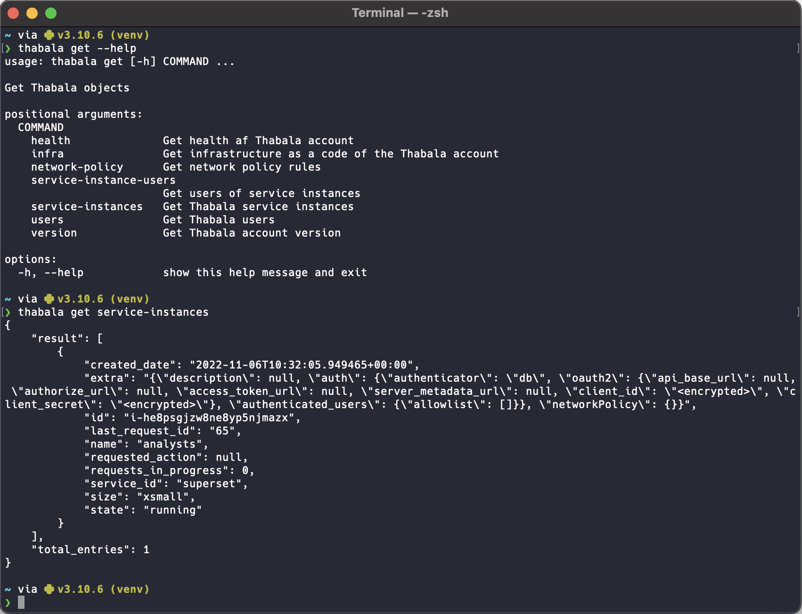

Thabala provides a command-line interface (CLI) to manage your Thabala account programmatically.
When using the command line, you can do everything that you can do on web by the Admin Console
but in a 

Using the Thabala CLI you can define Thabala infrastructure as a code, put it into a version
control system and implement modern and automated change management workflows.

:::tip

Most command-line tools, including thabala-cli have a `--help` flag that you can use to show
available commands and arguments. For example, you can use the `--help` falg with thabala-cli
in two ways:

* `thabala --help`: Lists the commands available for thabala-cli
* `thabala get --help`: Lists the flags available for the `get` command

:::
