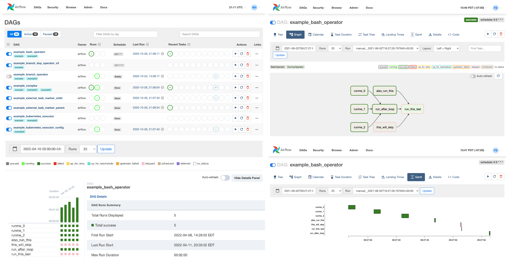

# About Airflow

Apache Airflow is a workflow management platform for data engineering pipelines to programmatically author,
schedule and monitor batch-oriented workflows.

Airflow is an open source Apache Project available at https://airflow.apache.org/

## Thabala Managed Airflow

Thabala Managed Airflow instances are pre-optimised and continuously maintained versions of the original open source codebase
that integrates with the Thabala Platform. The Thabala platform takes care about version upgrades, security patching,
scalability, monitoring, alerting and everything else that usually done by a dedicated in-house DevOps team.

Airflow service instances are easy to spin up and in general are operating in a "start it and forget about it" manner.
You are not required to build and maintain cloud infrastracture, containers, kubernetes clusters and so on.., or to develop
and maintain custom scripts to run the underlying infrastructure.

While the infrastructure and the airflow codebase is fully managed and updated regularily, the Thabala Platform still gives option to
modern tech teams to keep their in-house settings and manage operational changes as code. Like creating users, granting permissions or
integrating with the company's external authenticators.
