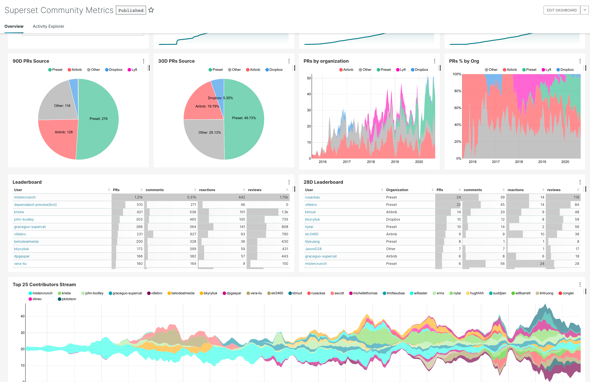

# About Superset

"Superset is fast, lightweight, intuitive, and loaded with options that make it easy for users of all skill sets to explore
and visualize their data, from simple line charts to highly detailed geospatial charts."

Superset is an open source Apache Project available at https://superset.apache.org/

## Thabala Managed Superset

Thabala Managed Superset instances are pre-optimised and continuously maintained versions of the original open source codebase
that integrates with the Thabala Platform. The Thabala platform takes care about version upgrades, security patching,
scalability, monitoring, alerting and everything else that usually done by a dedicated in-house DevOps team.

Superset service instances are easy to spin up and in general are operating in a "start it and forget about it" manner.
You are not required to build and maintain cloud infrastracture, containers, kubernetes clusters and so on.., or to develop
and maintain custom scripts to run the underlying infrastructure.

While the infrastructure and the superset codebase is fully managed and updated regularily, the Thabala Platform still gives option to
modern tech teams to keep their in-house settings and manage operational changes as code. Like creating users, granting permissions or
integrating with the company's external authenticators.
