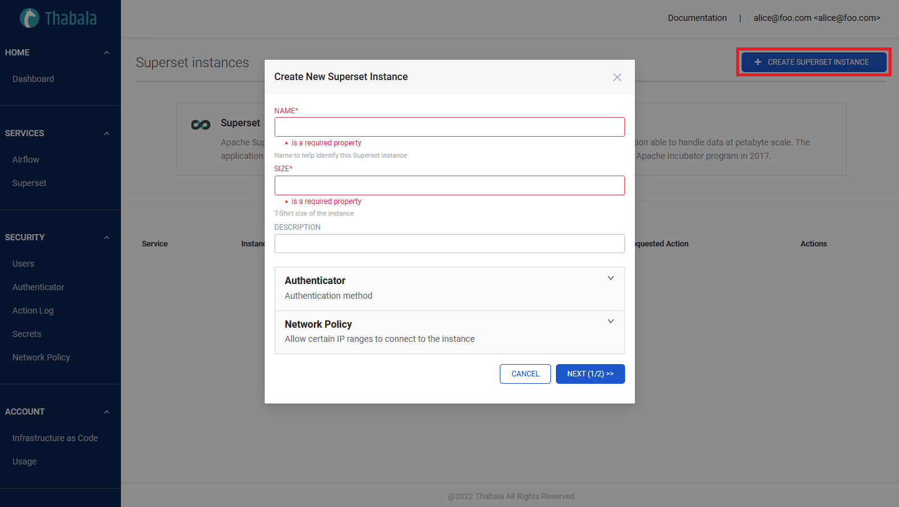
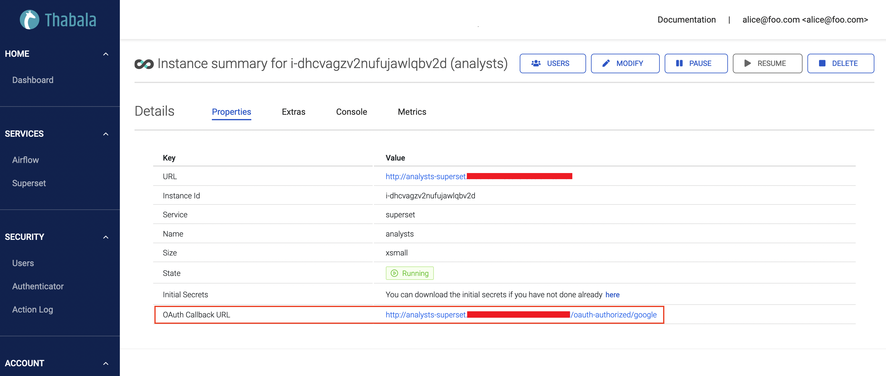
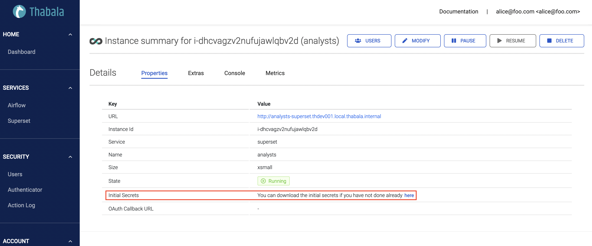
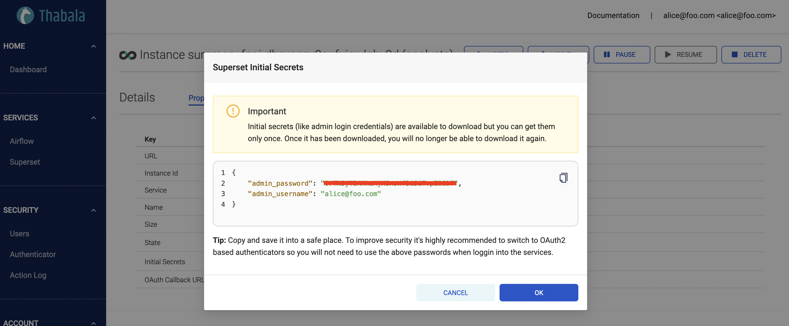
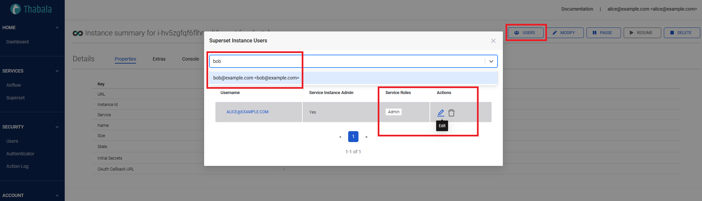

# Creating a Superset instance

To create a new Superset instance, go to **Services -> Superset** in the menu and click the
**+ CREATE SUPERSET INSTANCE** button.



Superset instance details:
* **Name**: Anything meaningful
* **Size**: It's recommended to start with **Extra Small** and scale up gradually when you need more resources.
* **Authenticator**: The authenticator type to authenticate users in the Superset instance. It
can be the user/password based Local Database Authenticator *(default)* or the more secure and recommended
[OAuth2.0 Authentication](/admin-console/security/oauth2) using one of the supported Identity Providers.

Once the form is submitted, a new Superset instance with an admin user will start being set up and shortly is
ready to use. Adding more users to the running Superset instance and granting permissions are controlled via
Thabala and detailed further in the next sections.

## Configure OAuth2.0 Authenticators

Similar to [Thabala Admin Console Authentication Types](/admin-console/security/authentication-types),
Superset instances can use multiple authenticion types, including the user/password based Local Database Authenticator
*(default)* and the more secure and recommended [OAuth2.0 Authentication](/admin-console/security/oauth2) with
one of the supported Identity Providers. Superset instances support the following Identity Providers:
* [GitHub](/admin-console/security/oauth2-github)
* [Google](/admin-console/security/oauth2-google)
* [Okta](/admin-console/security/oauth2-okta).

Configuring OAuth2 for Superset instances using one of the supported Identity Providers is similar to configuring
OAuth2 for the Thabala Admin Console. For further info please check the links above. The only difference is that
you need to create a unique OAuth app for each Superset instance and register unique
**Callback URL**, **Client ID** and **Client Secret**.

The **OAuth Callback URL** is generated if OAuth2 is configured for the Superset instance.
You need to define it in the OAuth app  in your Identity Provider *(GitHub, Google, Okta)*.



:::info

**OAuth2 details need to be unique** for each service instance. You can't use the same OAuth details across
multiple Superset or other service instances. It also needs to be different from the one used for the
Thabala Admin Console.

:::

### Extra options for OAuth2 authenticators:
* **Allowlist**: List of authenticated email patterns who are allowed to login. **Empty list means no pattern
so every authenticated user by the IdP is allowed to login** *(default)*.

## Initial secrets

Initial secrets including the Superset admin username and password to login at the first time. The admin user
is the same user that was used to create the new instance and the password is a random string which is
unique to each service instance.

:::caution

Initial secrets (like admin login credentials) are available to download but **you can get them only once**.
Once it has been downloaded, you will no longer be able to download it again.

:::

The link to the initial secrets is available in the properties tab of the new service instance:



Once the secrets displayed you'll no longer be able to download it again. You are responsible to keep
it in a safe place:



:::tip

* If you're using the user/password based Local Database Authenticator then changing the
password at the first login is strongly recommended.
* If you're using OAuth2 authenticator then **the admin user is authenticated by
the external Identity Provider and the generated password is not relevant**.
In this case it's safe to ignore the generated password.

:::

## Allocate users to Superset instance

Managing users is centralised in Thabala. You need to create users in Thabala and associate them to certain services.
This allows you to use the same user across the [Thabala Admin Console](/category/thabala-admin-console),
the [Thabala API](/thabala-api), the [Thabala CLI](/thabala-cli) and other managed service instances.

To create users please check the [Managing Users](/admin-console/security/managing-users) section.
To allocate an existing user to a superset instance




#### Service Roles

Available service roles are the same as provided by the Superset default settings.
For full descriptions and list of permissions please check the [Superset Roles Documentation](https://superset.apache.org/docs/security/).
Superset Services Roles that can be given to users:

* **Admin**: All possible rights
* **Alpha**: Access to all data sources, but they cannot grant or revoke access from other user
* **Gamma**: Limited access to data sources
* **sql_lab**: Access to SQL Lab
* **Public**: To allow logged-out users to access some Superset feature

:::caution

* **Service Roles are different than the Thabala [Built-in Permissions and Roles](/admin-console/security/roles-and-permissions)**.
Service roles are related to the running Superset instance and Thabala roles related to the Thabala Platform.
* **Service Instance Admins** can edit or scale the actual superset instance but not allowed to modify other service instances or other
Thabala settings.

:::

## Configuring Superset instance in the Thabala CLI

Optionally you can configure all Superset instances as YAML using the `ServiceInstance` kind and can apply it by the [Thabala CLI](/thabala-cli).

```yaml
kind: ServiceInstance
instance:
  service_id: superset
  name: analysts
  size: xsmall
  extra:
    description: null
    auth:
      authenticator: db
      oauth2: ~
      authenticated_users:
        allowlist: []
users:
- name: alice@foo.com
  admin: true
  service_roles:
  - Admin
```
