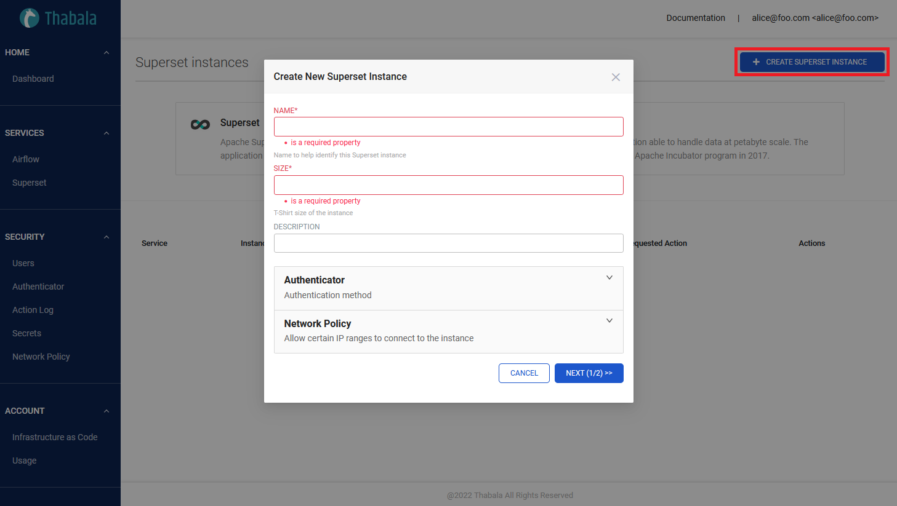
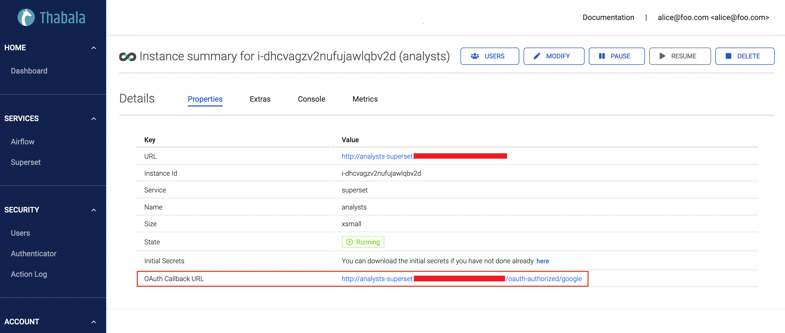
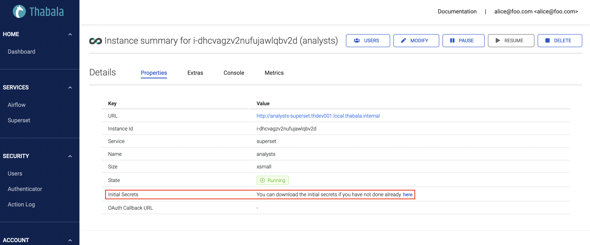
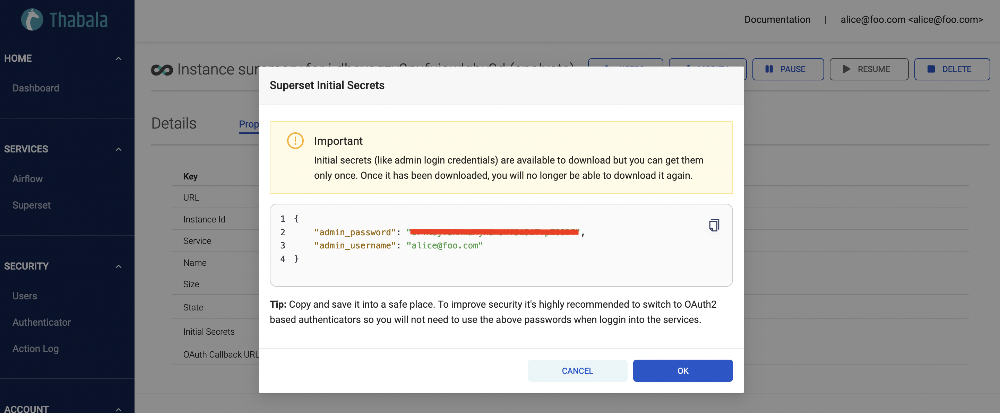

# Creating a Superset instance

To create a new superset instance go to **Services -> Superset** in the menu and click the
**+ CREATE SUPERSET INSTANCE** button.



Superset instance details:
* **Name**: Anything meaningful
* **Size**: It's recommended to start with **Extra Small** and scale up gradually when you need more resources.
* **Authenticator**: The authenticator type to authenticate users in the Superset instance. It
can be the user/password based Local Database Authenticator *(default)* or the more secure and recommended
[OAuth2.0 Authentication](/admin-console/security/oauth2) using one of the supported Identity Providers.

## Configure OAuth2.0 Authenticators

Similar to [Thabala Admin Console Authentication Types](/admin-console/security/authentication-types)
Superset instances can use multiple authenticion types, including the user/password based Local Database Authenticator
*(default)* and the more secure and recommended [OAuth2.0 Authentication](/admin-console/security/oauth2) with
one of the supported Identity Providers. Superset instances support the following Identity Providers:
* [GitHub](/admin-console/security/oauth2-github)
* [Google](/admin-console/security/oauth2-google)
* [Okta](/admin-console/security/oauth2-okta).

Configuring OAuth2 for Superset instances using one of the supported Identity Providers is similar to configure
OAuth2 for the Thabala Admin Console, for further info please check the links above. The only difference is that
you need to create unique OAuth app for each Superset instance and register unique
**Callback URL**, **Client ID** and **Client Secret**.

The **Callback URL** to use is generated when OAuth2 is configured for for the Superset instance.
You need to define it in the OAuth app that you created in your Identity Provider (GitHub, Google, Okta).



:::info

**OAuth2 details needs to be unique** for each service instance. You can't use the same OAuth details across
multiple Superset or other service instances. It also needs to be different than the one used for the
Thabala Admin Console.

:::

### Extra options for OAuth2 authenticators:
* **Allowlist**: List of authenticated email patterns who are allowed to login. **Empty list means no pattern
so every authenticated user by the IdP is allowed to login** (*default*).

## Initial secrets

Initial secrets including the Superset admin username/password that you can use to login to the new Superset instance
at the first time. The admin user is the same user which was used to create the new instance and the password is a random
string which is unique to each service instance.

:::caution

Initial secrets (like admin login credentials) are available to download but **you can get them only once**.
Once it has been downloaded, you will no longer be able to download it again.

:::

The link to the initial secrets is available in the properties tab of the new service instance:



Once the secrets displayed you'll no longer be able to download it again. You are responsible to keep
it in a safe place:



:::tip

**Tip 1**: If you're using the user/password based Local Database Authenticator then changing the
password at the first login is strongly recommended.

**Tip 2**: If you're using OAuth2 authenticator then **the admin user is authenticated by
the external Identity Provider and the generated password is not used**.
In this case it's safe to ignore the generated password.

:::


## Configuring Superset instance in the Thabala CLI

Optionally you can configure all superset instances as YAML using the `ServiceInstance` kind and can apply it by the [Thabala CLI](/thabala-cli).

```yaml
kind: ServiceInstance
instance:
  service_id: superset
  name: analysts
  size: xsmall
  extra:
    description: null
    auth:
      authenticator: db
      oauth2: ~
      authenticated_users:
        allowlist: []
users:
- name: alice@foo.com
  admin: true
  service_roles:
  - Admin
```
